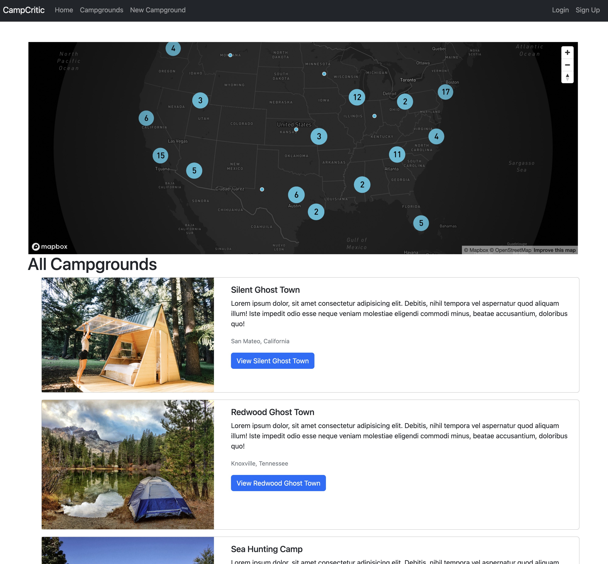

# CampCritic

CampCritic is a website for reviewing and rating campgrounds. Users can browse campgrounds, leave reviews, and view ratings.

## Demo

You can try out a live demo of CampCritic at the following link:

[https://campcritic.onrender.com/](https://campcritic.onrender.com/)

## Features
- Authentication and authorization
- Search for campgrounds on a cluster map.
- Leave reviews and ratings for campgrounds
- View ratings and reviews left by other users
- Filter search results by rating or location

## Technologies

CampCritic is built using HTML, CSS, JavaScript, and several open-source libraries and frameworks:

- [EJS](https://ejs.co/) for templating
- [Express](https://expressjs.com/) for the web server
- [MongoDB](https://www.mongodb.com/) for the database
- [Node.js](https://nodejs.org/) for the runtime environment

## Development

To run CampCritic locally on your machine, follow these steps:

1. Clone the repository: `git clone https://github.com/username/campcritic.git`
2. Navigate to the project directory: `cd campcritic`
3. Install the dependencies: `npm install`
4. Start the server: `npm start`
5. Open a web browser and go to `http://localhost:3000`

## Contributions

Contributions are welcome to CampCritic! If you have an idea for a new feature or have found a bug, please open an issue or submit a pull request.

